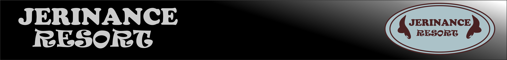
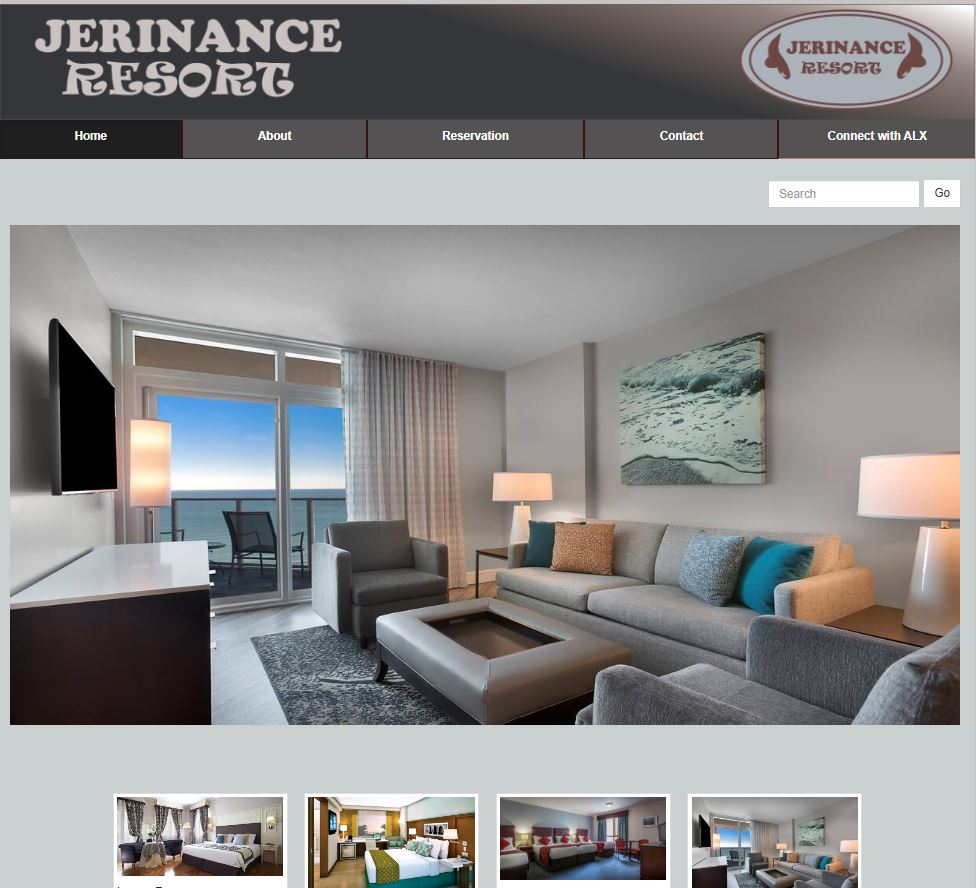
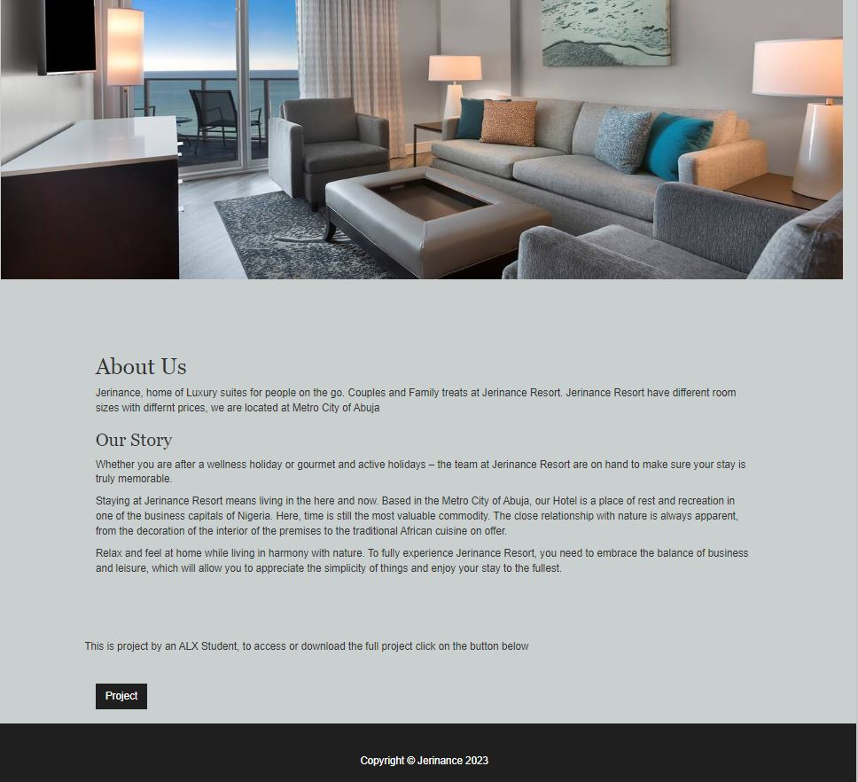
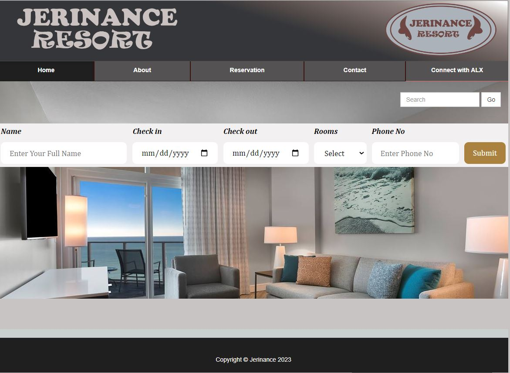
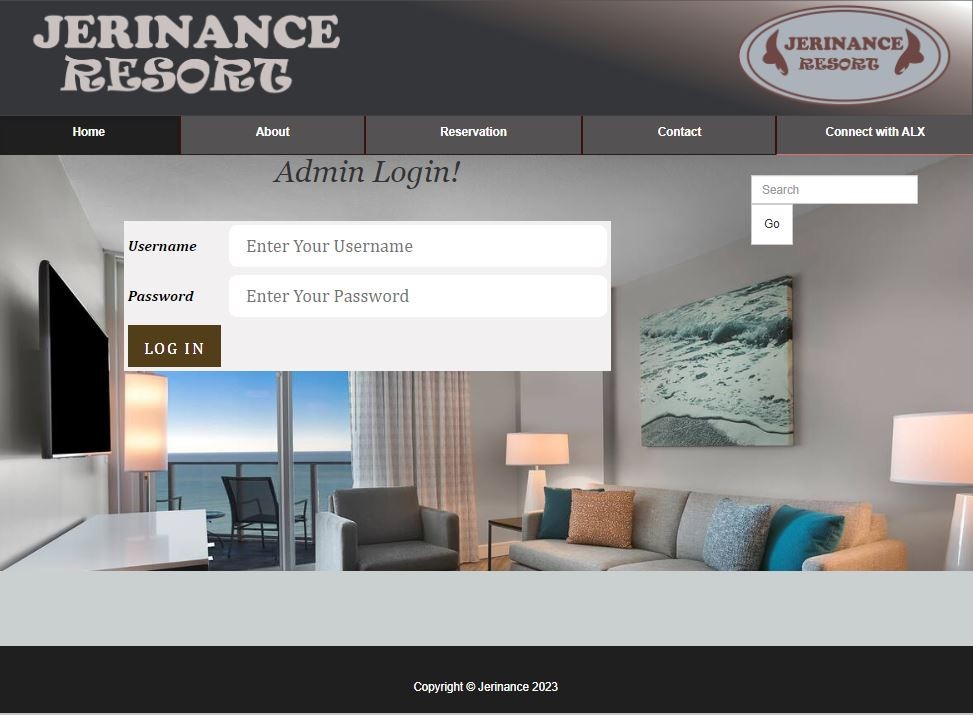

# Jerinance Resort

The Online Hotel Booking System is my final project at ALX. The system is designed for Jerinance Suite. It is a web system that provides an environment for users to book rooms online via computers or phones. The system is a 3-tier-distributed architecture that displays the user interface to a Web browser using PHP. The middle tier is the Apache Web server that handles requests from the client Web browser and provides access to the third tier MySQL database.

To view the deployed project, visit <a href="https://nancyiddy.github.io/Jerinance_Resort/">nancyiddy.github.io/Jerinance_Resort</a>

You can also connect with the author on Linkedin: <a href="https://www.linkedin.com/in/nancy-iddy/" target="_blank">Nancy_Iddy</a>

The main objective of the entire activity was to automate the process of day to day activities of Jerinance Resort, such as:

- Home Page.

- About Us.

- Room Reservation.

- Admin Login.

# Installation
- Ensure Wampserver is installed
- Start Wampserver and run phpMyAdmin and Localhost 
- Clone the repository inside `/Wamp/www`
- In the browser, search for `localhost/phpmyadmin` then import the database inside the folder `HotelReservation/db_hotel.sql`
- Browser `localhost/HotelReservation/` to start the project

# Contributing

The developer works tirelessly to improve and develop Hotel Reservation for Jerinance Resort. If you enjoy using the software, please consider donating to the developer, so he can spend more time implementing improvements. You can also contribute by getting involed with the source code.

## For devs
- Fork the repo
- play with it
- make pull requests

## For end-users
- Report bugs
- Suggest new features
- Be patient

# Built with
- HTML, Bootstrap - The User Interface.
- PHP - The Backend language.
- MySQL - Relational Database management system.

# Upcoming Features
- Email notifications for customers.
